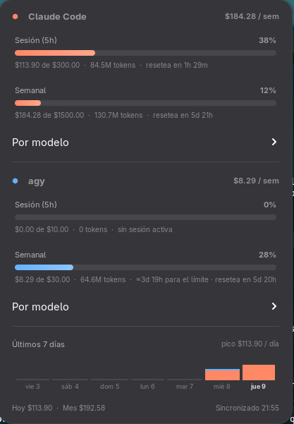

# AI Token Monitor

Unified token-usage monitor for local AI CLI tools (Claude Code, Gemini CLI,
...) on Linux. A lightweight daemon watches each tool's local logs via
inotify, normalizes usage into SQLite, and a native GNOME Shell extension
shows consolidated tokens + estimated cost in the top bar.

Target platform: **Fedora (GNOME Shell 45–50)**. Anything with systemd,
D-Bus and GNOME should work.



*Both bars are anchored to each provider's real rate-limit window and count
down to the actual reset; sections appear only for the tools you use.*

```
┌────────────────────────────────────────────────────────────────────┐
│ GNOME Shell top bar         ⬚ 12.4M · $3.12                        │
│                             (extension/ — GJS, ESM)                │
└──────────────▲─────────────────────────────────────────────────────┘
               │ D-Bus session bus: io.github.theyisuskill.AITokenMonitor
               │ GetSnapshot() / GetSummary(period) / signal UsageUpdated
┌──────────────┴─────────────────────────────────────────────────────┐
│ ai-token-monitor daemon (daemon/ — Python, GLib main loop)         │
│                                                                    │
│  LogWatcher (Gio.FileMonitor ≙ inotify, recursive, debounced)      │
│     │ new complete lines (offset-tracked tailing)                  │
│  Adapters (plugin registry + entry points)                         │
│     ├── claude_code   ~/.claude/projects/**/*.jsonl                │
│     ├── gemini_cli    ~/.gemini/tmp/**  +  antigravity-cli/*.db    │
│     ├── codex         ~/.codex/sessions/**/rollout-*.jsonl         │
│     └── opencode      ~/.local/share/opencode/opencode.db          │
│     │ UsageRecord (normalized)                                     │
│  CostEngine (pricing rules from config.yaml)                       │
│     │                                                              │
│  Store (SQLite WAL: usage history + dedup + tail offsets)          │
│      ~/.local/share/ai-token-monitor/usage.db                      │
└────────────────────────────────────────────────────────────────────┘
        config: ~/.config/ai-token-monitor/config.yaml
```

## Design notes

- **Python for the daemon.** The workload is I/O-trivial (tailing a few JSONL
  files); the deciding factors are ecosystem fit, not throughput. PyGObject
  gives `Gio.FileMonitor` (inotify) and the GLib main loop, `dasbus` gives a
  declarative D-Bus service on that same loop, and all dependencies are
  already packaged in Fedora — the RPM needs zero pip downloads. Rust would
  cut RSS from ~30 MB to ~3 MB at a significant cost in contributor
  accessibility for new adapters; Go has weaker GLib/D-Bus ergonomics.
- **D-Bus over a UNIX socket or local REST.** The consumer is a GNOME
  extension — GJS speaks D-Bus natively (`Gio.DBusProxy`), the bus provides
  activation (the daemon starts on first use via `SystemdService=`),
  lifecycle, and signals (push updates, no polling).
- **Native GNOME extension over AppIndicator/tray.** GNOME Shell has no
  system tray; AppIndicator support itself comes from a third-party
  extension, so a GTK4 tray app would *depend on an extension anyway* while
  adding a second process and IPC hop. The native extension is strictly more
  stable on stock Fedora. (An AppIndicator frontend for KDE/others can be
  added later — the daemon doesn't care who consumes the bus.)
- **Idempotent ingestion.** Every record carries a `dedup_key` derived from
  the log line (message id / request id / uuid) with a UNIQUE constraint, so
  file rewrites, inode rotation and full rescans are all safe.

## Install (per-user, for development)

Dependencies (Fedora): `sudo dnf install python3-gobject python3-dasbus
python3-pyyaml pipx`

```console
$ make install-user
$ systemctl --user daemon-reload && systemctl --user enable --now ai-token-monitor.service
$ make enable        # then log out/in on Wayland
```

Useful checks:

```console
$ ai-token-monitor --summary today | jq .totals
$ ai-token-monitor --history month | jq '.monthly'   # calendar months
$ ai-token-monitor --sessions 5 | jq                 # recent conversations
$ ai-token-monitor --live | jq                       # why is a bar an estimate?
$ busctl --user call io.github.theyisuskill.AITokenMonitor \
    /io/github/theyisuskill/AITokenMonitor \
    io.github.theyisuskill.AITokenMonitor1 GetSnapshot
$ journalctl --user -u ai-token-monitor -f
```

`--live` runs every enabled real-limit poller once and prints the raw result
(status, windows, and the reason for a failure) without the daemon running —
the first thing to ask for in a bug report.

## Configuration

Copy `data/config.example.yaml` to `~/.config/ai-token-monitor/config.yaml`.
Defaults are built in, so the file is optional. Pricing rules are fnmatch
patterns evaluated top-to-bottom (USD per 1M tokens) — keep them in sync with
your providers' current price lists.

### Usage limits (5-hour & weekly bars)

The panel menu shows a "Five Hour" and a "Weekly" bar per tool, mirroring the
*rolling* rate-limit windows that Claude Code and Antigravity actually enforce
(both reset on a rolling basis anchored to first use — the weekly window is a
trailing 7 days, **not** a calendar week that resets on Monday).

Providers don't publish a dollar figure for those limits, so the bars are
scaled by an API-equivalent budget that **adapts to your plan** rather than
being hardcoded. Declare your tier and the daemon resolves the ceilings:

```yaml
plans:
  claude_code: max_20x   # pro | max_5x | max_20x  (Max = 5x / 20x the Pro cap)
  gemini_cli: pro        # Antigravity: free | pro | ultra
  codex: plus            # OpenAI Codex CLI: go | plus | pro
budget_mode: preset      # preset (use the tiers) | auto (self-calibrate)
```

**Not every plan has both windows.** Codex on ChatGPT Go is metered on a
weekly allowance with no 5-hour session limit, so that tab shows the weekly
bar alone (with the last 5 hours' spend as plain context) instead of a session
bar standing for a limit the account doesn't have. The daemon works this out
from the plan — read from the Codex credential itself when you haven't
declared one — and a live poller corrects it with whatever the provider
actually reports.

The popup only shows tools you actually use: sections appear per tool with
recorded usage (one subscription → one section, three → three), so nothing is
hardcoded to a particular vendor mix.

`auto` ignores the tiers and instead calibrates each bar to your own busiest
observed 5h / 7-day window — useful if you don't know your plan's equivalent
value. Any explicit `budgets:` key (`claude_5h`, `claude_weekly`, `gemini_5h`,
`gemini_weekly`, `codex_5h`, `codex_weekly`) overrides both.

### Real limits (live)

The bars above are *estimates* — they scale token spend by a dollar-equivalent
budget. For Claude Code the daemon can instead show the provider's **real**
5-hour and weekly percentage with its exact reset, read from the OAuth usage
API using the token Claude Code already stores in `~/.claude/.credentials.json`
(the token needs the `user:profile` scope). Such a bar is marked with a teal
"live" dot and drives the top-bar percentage and alerts. This is the one
network feature — an opt-in relaxation of the local-only default — and it is
**read-only**: the daemon never rewrites the credential file. Configure under
`live_limits:` (enabled for `claude_code` by default; set `enabled: false` to
stay estimate-only). See `docs/codexbar-port-roadmap.md` for the other
providers this pattern can cover.

`enabled` also takes `auto`, which switches a poller on only when that
provider's credential is actually on this machine — the default for the Codex
poller, so it works out of the box if you use the Codex CLI and costs nothing
if you don't. When a poller can't report, the bar silently falls back to the
estimate and the popup says why, *except* for states that aren't faults (a tool
you simply aren't running stays quiet). `ai-token-monitor --live` prints the
full picture on demand.

Plans can also be picked from the extension's **Preferences window** (no YAML
required): choices are persisted to `~/.config/ai-token-monitor/ui.yaml`,
which overrides `config.yaml` for the UI-managed keys (`plans`,
`budget_mode`, `budgets`).

Around the bars the popup also shows:

- **Time-to-limit projection** — "≈3h left" per bar, extrapolated from the
  last hour (session bar) or last 24h (weekly bar) of spend.
- **Desktop alerts** when any bar crosses 70% / 90% / 100%; each threshold
  re-arms once usage drops back below it.
- **By model** — a collapsible top-3 cost breakdown per tool for the week.
- A 7-day spend sparkline above the footer.

### History

The last tab in the popup looks backwards over everything the database holds,
not just the current windows: 30 days of daily spend, calendar months with a
month-over-month change, where the money went by model, and your most recent
sessions (when, how long, how many requests, how much). It is fetched on demand
over `GetHistory` rather than carried in every snapshot, so it costs nothing
until you open it. Same data from the CLI with `--history` / `--sessions`.

### Waybar (Sway/Hyprland — no GNOME needed)

The daemon is frontend-agnostic; a `custom` Waybar module gets the same
at-a-glance signal as the GNOME indicator (most-pressured limit, per-tool
tooltip, `ok`/`warn`/`danger` class at 70/90%):

```json
"custom/ai-tokens": {
    "exec": "ai-token-monitor --waybar",
    "return-type": "json",
    "interval": 60,
    "format": "󱚝 {}"
}
```

### Reparsing history

Dedup keys are stable across re-reads, so parser or pricing fixes don't
retroactively update rows that are already stored. After such a fix:

```console
$ systemctl --user stop ai-token-monitor
$ ai-token-monitor --reparse gemini_cli   # drop + re-ingest one tool
$ systemctl --user start ai-token-monitor
```

## Writing an adapter

Subclass `Adapter` (three methods: `roots()`, `matches()`, `parse()`), and
either add it in-tree under `daemon/src/ai_token_monitor/adapters/` with the
`@register` decorator, or ship it as a separate pip package exposing the
entry point group `ai_token_monitor.adapters`. Adapters are pure parsers —
the daemon owns file watching, offsets and dedup. See
`adapters/claude_code.py` for the reference implementation.

## Packaging & publishing

See `packaging/COPR.md` for the step-by-step release flow.

- **RPM (recommended for Fedora):** `packaging/ai-token-monitor.spec` builds
  two subpackages — `ai-token-monitor` (daemon, `%pyproject` macros, systemd
  user unit, D-Bus activation) and `gnome-shell-extension-ai-token-monitor`.
  Publish through [Copr](https://copr.fedorainfracloud.org/) first (`make
  srpm && make copr`); submit for Fedora review once the API stabilizes.
  Always check `rpm -qlp` on the extension subpackage before publishing: it
  must carry `prefs.js`, `icons/` and the compiled `locale/*.mo` as well as
  `extension.js`, or the extension installs without Preferences, icons or
  translations.
- **extensions.gnome.org:** `make pack` produces the reviewable zip. E.G.O
  requires a GPL-compatible license (this project is GPL-3.0-or-later) and
  no bundled binaries — the extension is a pure D-Bus client, which is
  exactly what reviewers want to see. Say in the submission notes that it
  needs the daemon, and how to install it.
- **Why not Flatpak:** the daemon must read arbitrary dot-directories in
  `$HOME` (`~/.claude`, `~/.gemini`, ...) and own a session bus name, which
  defeats the sandbox (`filesystem=home` + `--own-name`), and GNOME
  extensions cannot be distributed as Flatpaks at all. RPM + E.G.O is the
  honest packaging story for this architecture.

## License

GPL-3.0-or-later. Fetch the license text into `LICENSE` before the first
release: `curl -o LICENSE https://www.gnu.org/licenses/gpl-3.0.txt`
